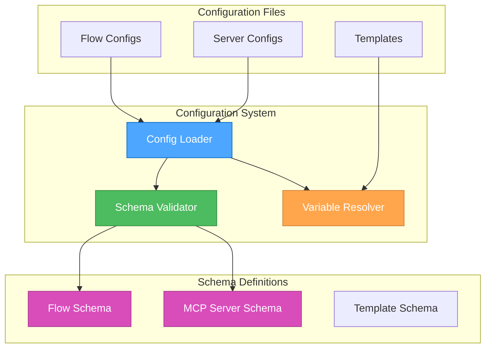

# 🎨🎨🎨 ENTERING CREATIVE PHASE: DATA MODEL DESIGN 🎨🎨🎨

## Focus: Configuration Schema Design
**Objective**: Design comprehensive JSON schemas for flow definitions and MCP server configurations
**Requirements**:
- Clear and intuitive flow definition structure
- Support for conditional logic and branching
- MCP server configuration with multiple transport types
- Validation rules for all configuration elements
- Extensibility for future features
- Human-readable and maintainable format

## PROBLEM STATEMENT
The configuration system needs to:
1. Define flows with steps, conditions, and transitions
2. Configure MCP servers with different transport mechanisms
3. Support variable substitution and environment references
4. Enable flow composition and reusability
5. Provide clear validation and error messages

## OPTIONS ANALYSIS

### Option 1: Simple Flat Structure
**Description**: Use a simple, flat JSON structure with minimal nesting

**Schema Example**:
```json
{
  "flow": {
    "id": "example-flow",
    "name": "Example Flow",
    "steps": [
      {
        "id": "step1",
        "type": "prompt",
        "prompt": "Analyze this code",
        "next": "step2"
      },
      {
        "id": "step2",
        "type": "condition",
        "condition": "result.hasErrors",
        "true": "step3",
        "false": "step4"
      }
    ]
  },
  "server": {
    "name": "github-mcp",
    "transport": "stdio",
    "command": "node",
    "args": ["github-mcp.js"]
  }
}
```

**Pros**:
- Simple to understand
- Easy to write by hand
- Minimal nesting
- Quick to parse

**Cons**:
- Limited expressiveness
- No type safety
- Difficult to extend
- No reusability features

**Complexity**: Low
**Implementation Time**: 1 day

### Option 2: Hierarchical with Types
**Description**: Use a more structured approach with explicit types and validation

**Schema Example**:
```json
{
  "flow": {
    "$schema": "https://flow-test-go/schemas/flow.json",
    "version": "1.0",
    "id": "complex-flow",
    "metadata": {
      "name": "Complex Analysis Flow",
      "description": "Analyzes code and creates issues",
      "author": "user@example.com"
    },
    "variables": {
      "maxRetries": 3,
      "timeout": 300
    },
    "steps": {
      "analyze": {
        "type": "prompt",
        "config": {
          "prompt": "Analyze the following code:\n{{code}}",
          "model": "gpt-4",
          "temperature": 0.7
        },
        "tools": ["read_file", "search_code"],
        "mcpServer": "filesystem",
        "transitions": {
          "default": "check-errors"
        }
      },
      "check-errors": {
        "type": "condition",
        "config": {
          "expression": "result.errors.length > 0"
        },
        "transitions": {
          "true": "create-issue",
          "false": "complete"
        }
      }
    }
  }
}
```

**Pros**:
- Type safety with schema validation
- More expressive
- Better organization
- Supports metadata

**Cons**:
- More complex structure
- Harder to write manually
- More verbose

**Complexity**: Medium
**Implementation Time**: 2-3 days

### Option 3: Modular Component-Based Design
**Description**: Design a modular system with reusable components and strong typing

**Flow Schema**:
```json
{
  "$schema": "https://flow-test-go/schemas/flow/v1.0.json",
  "version": "1.0",
  "id": "modular-flow",
  "name": "Modular Analysis Flow",
  "description": "A comprehensive code analysis workflow",
  "imports": [
    "./common/error-handling.json",
    "./common/github-tools.json"
  ],
  "variables": {
    "repository": "${GITHUB_REPO}",
    "branch": "${GITHUB_BRANCH:-main}",
    "issueLabels": ["bug", "automated"]
  },
  "inputs": {
    "filePath": {
      "type": "string",
      "required": true,
      "description": "Path to file to analyze"
    },
    "analysisType": {
      "type": "string",
      "enum": ["security", "performance", "style"],
      "default": "security"
    }
  },
  "steps": {
    "setup": {
      "type": "parallel",
      "steps": ["load-config", "init-tools"]
    },
    "load-config": {
      "type": "prompt",
      "prompt": {
        "template": "Load analysis configuration for {{inputs.analysisType}}",
        "model": "gpt-3.5-turbo"
      },
      "tools": ["read_file"],
      "mcpServer": "filesystem",
      "onError": "error-handler",
      "next": "wait-setup"
    },
    "analyze-code": {
      "type": "prompt",
      "prompt": {
        "template": "@templates/analyze-code.md",
        "variables": {
          "type": "{{inputs.analysisType}}",
          "file": "{{inputs.filePath}}"
        }
      },
      "tools": ["*"],
      "mcpServer": "{{variables.analysisServer}}",
      "timeout": 300,
      "next": "evaluate-results"
    },
    "evaluate-results": {
      "type": "condition",
      "conditions": [
        {
          "name": "has-critical-issues",
          "expression": "result.issues.some(i => i.severity === 'critical')",
          "next": "handle-critical"
        },
        {
          "name": "has-issues",
          "expression": "result.issues.length > 0",
          "next": "create-issue"
        },
        {
          "name": "default",
          "expression": "true",
          "next": "complete"
        }
      ]
    }
  },
  "templates": {
    "analyze-code.md": "Analyze the following {{type}} aspects of this code..."
  },
  "errorHandlers": {
    "error-handler": {
      "type": "prompt",
      "prompt": "An error occurred: {{error.message}}. How should we proceed?",
      "next": "complete"
    }
  }
}
```

**MCP Server Schema**:
```json
{
  "$schema": "https://flow-test-go/schemas/mcp-server/v1.0.json",
  "version": "1.0",
  "name": "github-mcp",
  "displayName": "GitHub MCP Server",
  "description": "Provides GitHub API integration tools",
  "transport": {
    "type": "stdio",
    "command": "node",
    "args": ["${MCP_SERVERS_PATH}/github-mcp/index.js"],
    "env": {
      "GITHUB_TOKEN": "${GITHUB_TOKEN}",
      "LOG_LEVEL": "info"
    }
  },
  "capabilities": {
    "tools": true,
    "resources": false,
    "prompts": false
  },
  "initialization": {
    "timeout": 30,
    "retries": 3,
    "healthCheck": {
      "method": "ping",
      "interval": 60
    }
  },
  "rateLimits": {
    "requests": {
      "max": 1000,
      "window": 3600
    },
    "concurrent": 10
  }
}
```

**Pros**:
- Highly modular and reusable
- Strong typing and validation
- Supports complex workflows
- Environment variable substitution
- Template support
- Error handling built-in
- Import/composition features

**Cons**:
- Most complex to implement
- Steeper learning curve
- Requires comprehensive documentation

**Complexity**: High
**Implementation Time**: 4-5 days

## RECOMMENDED APPROACH

**Chosen Option**: Option 3 - Modular Component-Based Design

**Rationale**:
1. Provides maximum flexibility for complex workflows
2. Supports reusability through imports and templates
3. Strong typing ensures configuration correctness
4. Environment variable support for different deployments
5. Built-in error handling and recovery
6. Future-proof design that can grow with requirements

## IMPLEMENTATION PLAN

### Phase 1: Core Schema Definitions
```go
// Flow schema types
type FlowConfig struct {
    Schema      string                 `json:"$schema"`
    Version     string                 `json:"version"`
    ID          string                 `json:"id"`
    Name        string                 `json:"name"`
    Description string                 `json:"description"`
    Imports     []string               `json:"imports,omitempty"`
    Variables   map[string]interface{} `json:"variables,omitempty"`
    Inputs      map[string]Input       `json:"inputs,omitempty"`
    Steps       map[string]Step        `json:"steps"`
    Templates   map[string]string      `json:"templates,omitempty"`
    ErrorHandlers map[string]Step      `json:"errorHandlers,omitempty"`
}

type Input struct {
    Type        string      `json:"type"`
    Required    bool        `json:"required"`
    Default     interface{} `json:"default,omitempty"`
    Description string      `json:"description,omitempty"`
    Enum        []string    `json:"enum,omitempty"`
}

type Step struct {
    Type        StepType               `json:"type"`
    Prompt      *PromptConfig          `json:"prompt,omitempty"`
    Conditions  []Condition            `json:"conditions,omitempty"`
    Tools       []string               `json:"tools,omitempty"`
    MCPServer   string                 `json:"mcpServer,omitempty"`
    Timeout     int                    `json:"timeout,omitempty"`
    OnError     string                 `json:"onError,omitempty"`
    Next        string                 `json:"next,omitempty"`
    Transitions map[string]string      `json:"transitions,omitempty"`
}

// MCP Server schema types
type MCPServerConfig struct {
    Schema        string            `json:"$schema"`
    Version       string            `json:"version"`
    Name          string            `json:"name"`
    DisplayName   string            `json:"displayName"`
    Description   string            `json:"description"`
    Transport     Transport         `json:"transport"`
    Capabilities  Capabilities      `json:"capabilities"`
    Initialization Initialization   `json:"initialization,omitempty"`
    RateLimits    *RateLimits      `json:"rateLimits,omitempty"`
}

type Transport struct {
    Type    string            `json:"type"`
    Command string            `json:"command,omitempty"`
    Args    []string          `json:"args,omitempty"`
    URL     string            `json:"url,omitempty"`
    Env     map[string]string `json:"env,omitempty"`
}
```

### Phase 2: Schema Validation
```go
type SchemaValidator struct {
    flowSchema   *jsonschema.Schema
    serverSchema *jsonschema.Schema
}

func NewSchemaValidator() (*SchemaValidator, error) {
    // Load schemas
    flowSchema, err := loadSchema("schemas/flow/v1.0.json")
    if err != nil {
        return nil, err
    }
    
    serverSchema, err := loadSchema("schemas/mcp-server/v1.0.json")
    if err != nil {
        return nil, err
    }
    
    return &SchemaValidator{
        flowSchema:   flowSchema,
        serverSchema: serverSchema,
    }, nil
}

func (v *SchemaValidator) ValidateFlow(data []byte) error {
    var flow FlowConfig
    if err := json.Unmarshal(data, &flow); err != nil {
        return err
    }
    
    // Validate against schema
    if err := v.flowSchema.Validate(flow); err != nil {
        return fmt.Errorf("flow validation failed: %w", err)
    }
    
    // Additional semantic validation
    return v.validateFlowSemantics(&flow)
}

func (v *SchemaValidator) validateFlowSemantics(flow *FlowConfig) error {
    // Check all step references exist
    for _, step := range flow.Steps {
        if step.Next != "" {
            if _, exists := flow.Steps[step.Next]; !exists {
                return fmt.Errorf("step '%s' references non-existent next step '%s'", step.Type, step.Next)
            }
        }
    }
    
    // Validate condition transitions
    for stepID, step := range flow.Steps {
        if step.Type == "condition" {
            for _, cond := range step.Conditions {
                if _, exists := flow.Steps[cond.Next]; !exists {
                    return fmt.Errorf("condition in step '%s' references non-existent step '%s'", stepID, cond.Next)
                }
            }
        }
    }
    
    return nil
}
```

### Phase 3: Variable Resolution
```go
type VariableResolver struct {
    env       map[string]string
    variables map[string]interface{}
}

func NewVariableResolver() *VariableResolver {
    return &VariableResolver{
        env:       make(map[string]string),
        variables: make(map[string]interface{}),
    }
}

func (r *VariableResolver) Resolve(template string, context map[string]interface{}) (string, error) {
    // Handle environment variables: ${VAR_NAME:-default}
    envPattern := regexp.MustCompile(`\$\{([A-Z_]+)(?::-(.*?))?\}`)
    result := envPattern.ReplaceAllStringFunc(template, func(match string) string {
        parts := envPattern.FindStringSubmatch(match)
        varName := parts[1]
        defaultValue := parts[2]
        
        if value, exists := os.LookupEnv(varName); exists {
            return value
        }
        return defaultValue
    })
    
    // Handle template variables: {{variable}}
    varPattern := regexp.MustCompile(`\{\{(.+?)\}\}`)
    result = varPattern.ReplaceAllStringFunc(result, func(match string) string {
        parts := varPattern.FindStringSubmatch(match)
        path := strings.TrimSpace(parts[1])
        
        // Navigate nested paths
        value := r.navigatePath(path, context)
        if value != nil {
            return fmt.Sprintf("%v", value)
        }
        return match
    })
    
    return result, nil
}

func (r *VariableResolver) navigatePath(path string, context map[string]interface{}) interface{} {
    parts := strings.Split(path, ".")
    current := interface{}(context)
    
    for _, part := range parts {
        switch v := current.(type) {
        case map[string]interface{}:
            current = v[part]
        default:
            return nil
        }
    }
    
    return current
}
```

### Phase 4: Configuration Loader
```go
type ConfigLoader struct {
    validator *SchemaValidator
    resolver  *VariableResolver
    cache     map[string]interface{}
}

func (l *ConfigLoader) LoadFlow(path string) (*FlowConfig, error) {
    // Read file
    data, err := os.ReadFile(path)
    if err != nil {
        return nil, err
    }
    
    // Resolve variables
    resolved, err := l.resolver.Resolve(string(data), nil)
    if err != nil {
        return nil, err
    }
    
    // Validate
    if err := l.validator.ValidateFlow([]byte(resolved)); err != nil {
        return nil, err
    }
    
    // Parse
    var flow FlowConfig
    if err := json.Unmarshal([]byte(resolved), &flow); err != nil {
        return nil, err
    }
    
    // Handle imports
    if err := l.handleImports(&flow); err != nil {
        return nil, err
    }
    
    return &flow, nil
}

func (l *ConfigLoader) handleImports(flow *FlowConfig) error {
    for _, importPath := range flow.Imports {
        imported, err := l.LoadFlow(importPath)
        if err != nil {
            return fmt.Errorf("failed to import %s: %w", importPath, err)
        }
        
        // Merge imported configuration
        l.mergeFlows(flow, imported)
    }
    
    return nil
}
```

## JSON SCHEMA DEFINITIONS

### Flow Schema (flow/v1.0.json)
```json
{
  "$schema": "http://json-schema.org/draft-07/schema#",
  "$id": "https://flow-test-go/schemas/flow/v1.0.json",
  "type": "object",
  "required": ["version", "id", "name", "steps"],
  "properties": {
    "version": {
      "type": "string",
      "pattern": "^\\d+\\.\\d+$"
    },
    "id": {
      "type": "string",
      "pattern": "^[a-z0-9-]+$"
    },
    "name": {
      "type": "string"
    },
    "steps": {
      "type": "object",
      "patternProperties": {
        "^[a-z0-9-]+$": {
          "$ref": "#/definitions/step"
        }
      }
    }
  },
  "definitions": {
    "step": {
      "type": "object",
      "required": ["type"],
      "properties": {
        "type": {
          "enum": ["prompt", "condition", "parallel"]
        }
      }
    }
  }
}
```

## ARCHITECTURE DIAGRAM



## VALIDATION

**Requirements Met**:
- ✓ Clear flow definition structure
- ✓ Conditional logic and branching support
- ✓ MCP server configuration flexibility
- ✓ Comprehensive validation rules
- ✓ Extensibility through modular design
- ✓ Human-readable JSON format

**Technical Feasibility**: High - Standard JSON with schema validation
**Risk Assessment**: Low - Well-established configuration patterns

🎨 CREATIVE CHECKPOINT: Configuration Schema Design Complete

The modular component-based design provides maximum flexibility while maintaining clarity. The schema validation ensures configuration correctness at load time.

🎨🎨🎨 EXITING CREATIVE PHASE - DECISION MADE ��🎨🎨

**Summary**: Modular Component-Based Configuration Design selected
**Key Decisions**:
- JSON with schema validation
- Variable substitution support
- Import/composition capabilities
- Template support for prompts
- Strong typing throughout

**Next Steps**: Proceed with Error Recovery Strategy design
