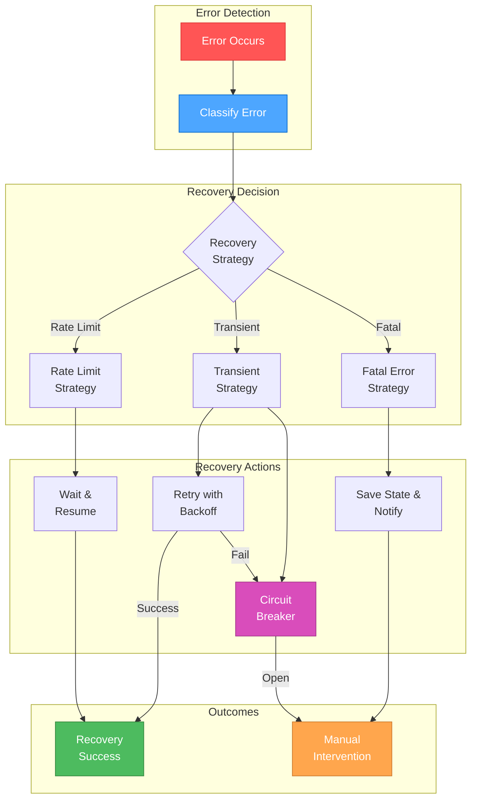

# 🎨🎨🎨 ENTERING CREATIVE PHASE: ALGORITHM DESIGN 🎨🎨🎨

## Focus: Error Recovery Strategy
**Objective**: Design a fault-tolerant execution system with checkpoint/resume capabilities for multi-step AI workflows
**Requirements**:
- Checkpoint state at each step completion
- Resume from last successful checkpoint
- Handle transient errors with retry logic
- Support manual intervention for critical errors
- Maintain execution history for debugging
- Graceful degradation when possible

## PROBLEM STATEMENT
The error recovery system needs to:
1. Handle various failure types (network, API limits, invalid responses)
2. Persist execution state for recovery
3. Implement intelligent retry strategies
4. Provide clear error reporting
5. Support both automatic and manual recovery
6. Maintain data consistency across failures

## OPTIONS ANALYSIS

### Option 1: Simple Retry with Exponential Backoff
**Description**: Basic retry mechanism with exponential backoff for transient errors

**Architecture**:
```go
type RetryStrategy struct {
    MaxRetries int
    BaseDelay  time.Duration
    MaxDelay   time.Duration
}

func (r *RetryStrategy) Execute(fn func() error) error {
    var err error
    delay := r.BaseDelay
    
    for i := 0; i <= r.MaxRetries; i++ {
        err = fn()
        if err == nil {
            return nil
        }
        
        if i < r.MaxRetries {
            time.Sleep(delay)
            delay *= 2
            if delay > r.MaxDelay {
                delay = r.MaxDelay
            }
        }
    }
    
    return err
}
```

**Pros**:
- Simple to implement
- Handles transient errors well
- Low overhead
- Easy to understand

**Cons**:
- No state persistence
- Cannot resume after process restart
- Limited error categorization
- No manual intervention support

**Complexity**: Low
**Implementation Time**: 1 day

### Option 2: Checkpoint-Based Recovery
**Description**: Save execution state at checkpoints and resume from last successful point

**Architecture**:
```go
type CheckpointManager struct {
    storage     Storage
    flowID      string
    checkpoints []Checkpoint
}

type Checkpoint struct {
    ID        string
    StepID    string
    State     map[string]interface{}
    Timestamp time.Time
}

func (m *CheckpointManager) Save(stepID string, state map[string]interface{}) error {
    checkpoint := Checkpoint{
        ID:        uuid.New().String(),
        StepID:    stepID,
        State:     state,
        Timestamp: time.Now(),
    }
    
    m.checkpoints = append(m.checkpoints, checkpoint)
    return m.storage.Save(m.flowID, checkpoint)
}

func (m *CheckpointManager) Resume() (*Checkpoint, error) {
    checkpoints, err := m.storage.Load(m.flowID)
    if err != nil {
        return nil, err
    }
    
    if len(checkpoints) > 0 {
        return &checkpoints[len(checkpoints)-1], nil
    }
    
    return nil, nil
}
```

**Pros**:
- Can resume after restart
- Clear recovery points
- State persistence
- Good for long-running flows

**Cons**:
- Storage overhead
- Complex state management
- No error classification
- Limited retry strategies

**Complexity**: Medium
**Implementation Time**: 2-3 days

### Option 3: Comprehensive Fault Tolerance System
**Description**: Full-featured error recovery with categorized handling, intelligent retries, and manual intervention support

**Architecture**:
```go
// Error classification
type ErrorCategory int

const (
    ErrorTransient ErrorCategory = iota  // Network issues, temp failures
    ErrorRateLimit                       // API rate limits
    ErrorInvalid                         // Invalid input/config
    ErrorFatal                          // Unrecoverable errors
)

// Main recovery system
type RecoverySystem struct {
    checkpointer   *Checkpointer
    errorHandler   *ErrorHandler
    retryManager   *RetryManager
    circuitBreaker *CircuitBreaker
    eventLog       *EventLog
}

// Error handler with categorization
type ErrorHandler struct {
    classifiers []ErrorClassifier
    handlers    map[ErrorCategory]Handler
}

type ErrorClassifier interface {
    Classify(error) (ErrorCategory, bool)
}

// Intelligent retry manager
type RetryManager struct {
    strategies map[ErrorCategory]RetryStrategy
}

type RetryStrategy interface {
    ShouldRetry(attempt int, err error) bool
    NextDelay(attempt int) time.Duration
}

// Circuit breaker for failing services
type CircuitBreaker struct {
    failures      int
    threshold     int
    timeout       time.Duration
    state         BreakerState
    lastFailure   time.Time
}

// Checkpoint system with versioning
type Checkpointer struct {
    storage       Storage
    compression   bool
    encryption    bool
    retentionDays int
}

type Checkpoint struct {
    ID            string
    FlowID        string
    Version       int
    StepID        string
    State         *ExecutionState
    Timestamp     time.Time
    Hash          string  // For integrity
}

type ExecutionState struct {
    Variables     map[string]interface{}
    Conversation  []Message
    StepResults   map[string]StepResult
    CurrentStep   string
    mu            sync.RWMutex
}

// Recovery coordinator
type RecoveryCoordinator struct {
    system      *RecoverySystem
    flowEngine  *FlowEngine
    notifier    *Notifier
}

func (c *RecoveryCoordinator) HandleError(ctx context.Context, err error, state *ExecutionState) error {
    // Classify error
    category := c.system.errorHandler.Classify(err)
    
    // Log event
    c.system.eventLog.LogError(state.CurrentStep, err, category)
    
    // Check circuit breaker
    if c.system.circuitBreaker.IsOpen() {
        return fmt.Errorf("circuit breaker open: %w", err)
    }
    
    // Handle based on category
    switch category {
    case ErrorTransient:
        return c.handleTransientError(ctx, err, state)
    case ErrorRateLimit:
        return c.handleRateLimitError(ctx, err, state)
    case ErrorInvalid:
        return c.handleInvalidError(ctx, err, state)
    case ErrorFatal:
        return c.handleFatalError(ctx, err, state)
    }
    
    return err
}

func (c *RecoveryCoordinator) handleTransientError(ctx context.Context, err error, state *ExecutionState) error {
    strategy := c.system.retryManager.GetStrategy(ErrorTransient)
    attempt := 0
    
    for strategy.ShouldRetry(attempt, err) {
        delay := strategy.NextDelay(attempt)
        c.system.eventLog.LogRetry(state.CurrentStep, attempt, delay)
        
        select {
        case <-ctx.Done():
            return ctx.Err()
        case <-time.After(delay):
            // Retry execution
            result, retryErr := c.flowEngine.RetryStep(state.CurrentStep, state)
            if retryErr == nil {
                return nil
            }
            err = retryErr
            attempt++
        }
    }
    
    // Max retries exceeded
    c.system.circuitBreaker.RecordFailure()
    return err
}

func (c *RecoveryCoordinator) handleRateLimitError(ctx context.Context, err error, state *ExecutionState) error {
    // Extract wait time from error
    waitTime := extractRateLimitWait(err)
    if waitTime == 0 {
        waitTime = 60 * time.Second // Default wait
    }
    
    c.system.eventLog.LogRateLimit(state.CurrentStep, waitTime)
    
    // Save checkpoint before waiting
    checkpoint := c.createCheckpoint(state)
    if err := c.system.checkpointer.Save(checkpoint); err != nil {
        return fmt.Errorf("failed to save checkpoint: %w", err)
    }
    
    // Notify about wait
    c.notifier.NotifyWait(fmt.Sprintf("Rate limited. Waiting %v before retry", waitTime))
    
    select {
    case <-ctx.Done():
        return ctx.Err()
    case <-time.After(waitTime):
        return c.flowEngine.RetryStep(state.CurrentStep, state)
    }
}

func (c *RecoveryCoordinator) handleFatalError(ctx context.Context, err error, state *ExecutionState) error {
    // Save final state
    checkpoint := c.createCheckpoint(state)
    checkpoint.State.SetError(err)
    c.system.checkpointer.Save(checkpoint)
    
    // Notify for manual intervention
    c.notifier.NotifyFatalError(fmt.Sprintf(
        "Fatal error in flow %s at step %s: %v. Manual intervention required.",
        state.FlowID, state.CurrentStep, err,
    ))
    
    return fmt.Errorf("fatal error requiring manual intervention: %w", err)
}
```

### Implementation Details:

**1. Error Classification**:
```go
type HTTPErrorClassifier struct{}

func (h *HTTPErrorClassifier) Classify(err error) (ErrorCategory, bool) {
    var httpErr *HTTPError
    if errors.As(err, &httpErr) {
        switch httpErr.StatusCode {
        case 429:
            return ErrorRateLimit, true
        case 500, 502, 503, 504:
            return ErrorTransient, true
        case 400, 422:
            return ErrorInvalid, true
        case 401, 403:
            return ErrorFatal, true
        }
    }
    return ErrorTransient, false
}
```

**2. Retry Strategies**:
```go
type ExponentialBackoffStrategy struct {
    MaxRetries   int
    InitialDelay time.Duration
    MaxDelay     time.Duration
    Multiplier   float64
}

func (s *ExponentialBackoffStrategy) ShouldRetry(attempt int, err error) bool {
    return attempt < s.MaxRetries
}

func (s *ExponentialBackoffStrategy) NextDelay(attempt int) time.Duration {
    delay := s.InitialDelay * time.Duration(math.Pow(s.Multiplier, float64(attempt)))
    if delay > s.MaxDelay {
        return s.MaxDelay
    }
    return delay
}

type AdaptiveRetryStrategy struct {
    history      []time.Duration
    successRate  float64
}

func (s *AdaptiveRetryStrategy) NextDelay(attempt int) time.Duration {
    // Adjust delay based on success rate
    if s.successRate < 0.5 {
        return time.Duration(attempt) * time.Minute
    }
    return time.Duration(attempt) * 10 * time.Second
}
```

**3. State Persistence**:
```go
type FileSystemStorage struct {
    basePath string
}

func (s *FileSystemStorage) Save(checkpoint *Checkpoint) error {
    // Serialize state
    data, err := json.Marshal(checkpoint)
    if err != nil {
        return err
    }
    
    // Compress if enabled
    if checkpoint.Compression {
        data = compress(data)
    }
    
    // Encrypt if enabled
    if checkpoint.Encryption {
        data = encrypt(data)
    }
    
    // Save to file
    path := filepath.Join(s.basePath, checkpoint.FlowID, checkpoint.ID+".checkpoint")
    return os.WriteFile(path, data, 0600)
}

func (s *FileSystemStorage) LoadLatest(flowID string) (*Checkpoint, error) {
    pattern := filepath.Join(s.basePath, flowID, "*.checkpoint")
    files, err := filepath.Glob(pattern)
    if err != nil {
        return nil, err
    }
    
    if len(files) == 0 {
        return nil, nil
    }
    
    // Sort by modification time
    sort.Slice(files, func(i, j int) bool {
        fi, _ := os.Stat(files[i])
        fj, _ := os.Stat(files[j])
        return fi.ModTime().After(fj.ModTime())
    })
    
    // Load latest
    data, err := os.ReadFile(files[0])
    if err != nil {
        return nil, err
    }
    
    var checkpoint Checkpoint
    return &checkpoint, json.Unmarshal(data, &checkpoint)
}
```

**Pros**:
- Comprehensive error handling
- Intelligent retry strategies
- Circuit breaker protection
- Manual intervention support
- Detailed event logging
- State persistence with versioning
- Graceful degradation

**Cons**:
- Most complex implementation
- Higher resource usage
- More components to maintain

**Complexity**: High
**Implementation Time**: 5-6 days

## RECOMMENDED APPROACH

**Chosen Option**: Option 3 - Comprehensive Fault Tolerance System

**Rationale**:
1. Production-ready solution with all necessary features
2. Handles all types of failures gracefully
3. Supports both automatic and manual recovery
4. Provides detailed debugging information
5. Scales with system complexity
6. Circuit breaker prevents cascade failures

## IMPLEMENTATION PLAN

### Phase 1: Core Recovery Infrastructure
- Implement error classification system
- Create retry strategy framework
- Build checkpoint storage layer
- Set up event logging

### Phase 2: Recovery Strategies
- Implement exponential backoff
- Add adaptive retry logic
- Create circuit breaker
- Build rate limit handler

### Phase 3: State Management
- Implement checkpoint versioning
- Add state compression
- Create integrity checking
- Build cleanup routines

### Phase 4: Integration
- Integrate with flow engine
- Add recovery coordinator
- Implement notifications
- Create recovery CLI commands

## ERROR RECOVERY FLOW DIAGRAM



## VALIDATION

**Requirements Met**:
- ✓ Checkpoint state at each step
- ✓ Resume from last checkpoint
- ✓ Transient error retry logic
- ✓ Manual intervention support
- ✓ Execution history logging
- ✓ Graceful degradation via circuit breaker

**Technical Feasibility**: High - Well-established patterns
**Risk Assessment**: Low - Comprehensive error handling reduces risks

🎨 CREATIVE CHECKPOINT: Error Recovery Design Complete

The comprehensive fault tolerance system provides production-grade reliability with intelligent error handling and recovery capabilities.

🎨🎨🎨 EXITING CREATIVE PHASE - DECISION MADE 🎨🎨🎨

**Summary**: Comprehensive Fault Tolerance System selected
**Key Decisions**:
- Error categorization for targeted handling
- Multiple retry strategies
- Circuit breaker protection
- Checkpoint-based state persistence
- Manual intervention support

**Next Steps**: All creative phases complete - ready for IMPLEMENT mode
