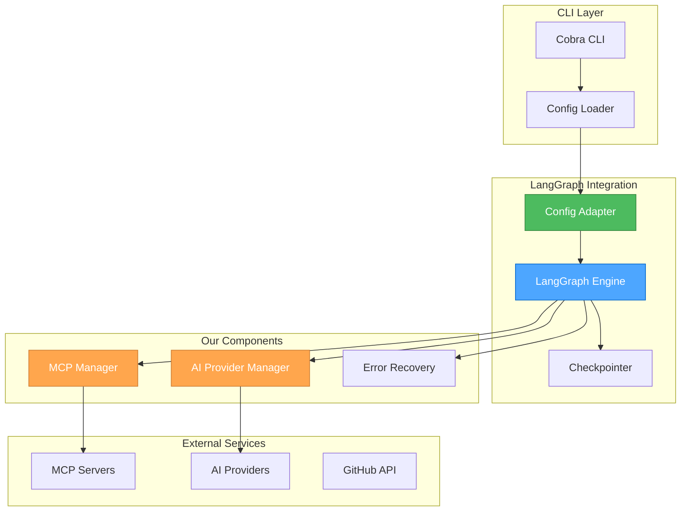

# 🎨🎨🎨 ENTERING CREATIVE PHASE: ARCHITECTURE REVISION 🎨🎨🎨

## Focus: LangGraph Integration Strategy
**Objective**: Revise our flow engine architecture to use LangGraph/langgraphgo as the core orchestration framework
**Requirements**:
- Integrate langgraphgo for flow orchestration
- Maintain our MCP server integration design
- Preserve our plugin system architecture
- Adapt our configuration schema to work with LangGraph
- Ensure our error recovery strategy works with LangGraph

## PROBLEM STATEMENT
Instead of building a custom flow engine, we will leverage LangGraph which provides:
1. Built-in state management and persistence
2. Human-in-the-loop capabilities
3. Durable execution with automatic resumption
4. Production-ready deployment features
5. Integration with LangSmith for debugging

## REVISED ARCHITECTURE

### Core Integration Points

**1. Flow Engine Replacement**
Replace our custom Hybrid Orchestrator with LangGraph:

```go
import (
    "github.com/tmc/langgraphgo/graph"
    "github.com/tmc/langchaingo/llms"
)

type FlowEngine struct {
    graph      *graph.MessageGraph
    mcpManager *MCPManager
    aiManager  *AIProviderManager
    config     *FlowConfig
}

func NewFlowEngine(config *FlowConfig) (*FlowEngine, error) {
    g := graph.NewMessageGraph()
    
    engine := &FlowEngine{
        graph:  g,
        config: config,
    }
    
    // Build graph from config
    if err := engine.buildGraph(); err != nil {
        return nil, err
    }
    
    return engine, nil
}

func (e *FlowEngine) buildGraph() error {
    // Add nodes for each step in config
    for stepID, step := range e.config.Steps {
        e.graph.AddNode(stepID, e.createNodeHandler(step))
    }
    
    // Add edges based on transitions
    for stepID, step := range e.config.Steps {
        if step.Next != "" {
            e.graph.AddEdge(stepID, step.Next)
        }
        // Handle conditional transitions
        for condition, target := range step.Transitions {
            e.graph.AddConditionalEdge(stepID, e.createCondition(condition), target)
        }
    }
    
    // Set entry point
    e.graph.SetEntryPoint(e.config.InitialStep)
    
    return nil
}
```

**2. Node Handler Integration**
Create node handlers that integrate our MCP and AI providers:

```go
func (e *FlowEngine) createNodeHandler(step Step) graph.NodeFunc {
    return func(ctx context.Context, state []llms.MessageContent) ([]llms.MessageContent, error) {
        // Create execution context
        execCtx := &ExecutionContext{
            State:     state,
            Variables: e.extractVariables(state),
            Step:      step,
        }
        
        switch step.Type {
        case StepTypePrompt:
            return e.handlePromptStep(ctx, execCtx)
        case StepTypeCondition:
            return e.handleConditionStep(ctx, execCtx)
        case StepTypeParallel:
            return e.handleParallelStep(ctx, execCtx)
        default:
            return state, fmt.Errorf("unknown step type: %s", step.Type)
        }
    }
}

func (e *FlowEngine) handlePromptStep(ctx context.Context, execCtx *ExecutionContext) ([]llms.MessageContent, error) {
    // Get AI provider
    provider, err := e.aiManager.GetProvider(execCtx.Step.Provider)
    if err != nil {
        return nil, err
    }
    
    // Get MCP tools if specified
    var tools []Tool
    if execCtx.Step.MCPServer != "" {
        tools, err = e.mcpManager.GetTools(execCtx.Step.MCPServer, execCtx.Step.Tools)
        if err != nil {
            return nil, err
        }
    }
    
    // Build prompt with variable substitution
    prompt := e.buildPrompt(execCtx)
    
    // Execute with provider
    response, err := provider.Complete(ctx, CompletionRequest{
        Messages:  append(execCtx.State, llms.TextParts(schema.ChatMessageTypeHuman, prompt)),
        Tools:     tools,
        MaxTokens: execCtx.Step.MaxTokens,
    })
    
    if err != nil {
        return nil, e.handleError(err, execCtx)
    }
    
    // Append response to state
    return append(execCtx.State, llms.TextParts(schema.ChatMessageTypeAI, response.Content)), nil
}
```

**3. Configuration Adapter**
Adapt our configuration schema to work with LangGraph:

```go
type LangGraphAdapter struct {
    config    *FlowConfig
    graph     *graph.StateGraph
    checkpointer graph.Checkpointer
}

func (a *LangGraphAdapter) Build() (*graph.CompiledGraph, error) {
    // Create state graph with our state schema
    g := graph.NewStateGraph(FlowStateSchema{})
    
    // Add nodes from config
    for id, step := range a.config.Steps {
        g.AddNode(id, a.adaptStep(step))
    }
    
    // Add edges and conditions
    for id, step := range a.config.Steps {
        a.addTransitions(g, id, step)
    }
    
    // Set entry point
    g.SetEntryPoint(a.config.InitialStep)
    
    // Add checkpointing
    if a.checkpointer != nil {
        g.SetCheckpointer(a.checkpointer)
    }
    
    return g.Compile()
}

// State schema for LangGraph
type FlowStateSchema struct {
    Messages     []llms.MessageContent `json:"messages"`
    Variables    map[string]interface{} `json:"variables"`
    CurrentStep  string                `json:"current_step"`
    Error        error                 `json:"error,omitempty"`
    Checkpoint   string                `json:"checkpoint,omitempty"`
}
```

**4. Error Recovery Integration**
Integrate our error recovery with LangGraph's checkpointing:

```go
type LangGraphCheckpointer struct {
    storage      Storage
    retryManager *RetryManager
}

func (c *LangGraphCheckpointer) Save(ctx context.Context, config graph.CheckpointConfig) error {
    checkpoint := &Checkpoint{
        ID:        config.ID,
        State:     config.State,
        Timestamp: time.Now(),
    }
    
    return c.storage.Save(checkpoint)
}

func (c *LangGraphCheckpointer) Load(ctx context.Context, id string) (*graph.CheckpointConfig, error) {
    checkpoint, err := c.storage.Load(id)
    if err != nil {
        return nil, err
    }
    
    return &graph.CheckpointConfig{
        ID:    checkpoint.ID,
        State: checkpoint.State,
    }, nil
}

// Wrap LangGraph execution with our error recovery
func (e *FlowEngine) ExecuteWithRecovery(ctx context.Context, input []llms.MessageContent) ([]llms.MessageContent, error) {
    compiled, err := e.graph.Compile()
    if err != nil {
        return nil, err
    }
    
    // Set up checkpointing
    compiled.SetCheckpointer(e.checkpointer)
    
    // Execute with retry logic
    var result []llms.MessageContent
    err = e.retryManager.Execute(func() error {
        res, err := compiled.Invoke(ctx, input)
        if err != nil {
            return e.classifyAndHandleError(err)
        }
        result = res.([]llms.MessageContent)
        return nil
    })
    
    return result, err
}
```

**5. MCP Tool Integration**
Create LangGraph-compatible tools from MCP servers:

```go
func (e *FlowEngine) createLangGraphTool(mcpTool Tool) graph.Tool {
    return graph.Tool{
        Name:        mcpTool.Name,
        Description: mcpTool.Description,
        Function: func(ctx context.Context, args map[string]interface{}) (interface{}, error) {
            // Execute via MCP server
            return e.mcpManager.ExecuteTool(ctx, mcpTool.ServerName, mcpTool.Name, args)
        },
    }
}
```

## BENEFITS OF LANGGRAPH INTEGRATION

1. **Reduced Complexity**: No need to build custom state machine and execution engine
2. **Built-in Features**: Get checkpointing, human-in-the-loop, and persistence for free
3. **Production Ready**: LangGraph is battle-tested in production environments
4. **Better Debugging**: Integration with LangSmith for visualization and debugging
5. **Community Support**: Active community and ongoing development

## ARCHITECTURAL DIAGRAM



## IMPLEMENTATION PLAN

### Phase 1: Core Integration
1. Add langgraphgo dependency
2. Create basic graph builder from config
3. Implement simple prompt nodes
4. Test basic flow execution

### Phase 2: Advanced Features
1. Add conditional edges
2. Implement parallel execution nodes
3. Integrate checkpointing
4. Add state management

### Phase 3: Service Integration
1. Connect MCP manager to nodes
2. Wire AI provider manager
3. Implement tool execution
4. Add error recovery wrapper

### Phase 4: Production Features
1. Add comprehensive logging
2. Implement metrics collection
3. Create debugging utilities
4. Add human-in-the-loop support

## VALIDATION

**Requirements Met**:
- ✓ Flow orchestration via LangGraph
- ✓ MCP server integration maintained
- ✓ Plugin system architecture preserved
- ✓ Configuration schema adapted
- ✓ Error recovery integrated

🎨 CREATIVE CHECKPOINT: LangGraph Integration Design Complete

The integration of LangGraph simplifies our architecture while providing more robust features than our custom implementation would have offered.

🎨🎨🎨 EXITING CREATIVE PHASE - DECISION MADE 🎨🎨🎨

**Summary**: Use LangGraph as core flow engine
**Key Decisions**:
- Replace custom orchestrator with LangGraph
- Adapt configuration to build LangGraph graphs
- Integrate MCP and AI providers as LangGraph nodes
- Wrap LangGraph checkpointing with our error recovery

**Next Steps**: Update implementation plan to use langgraphgo
