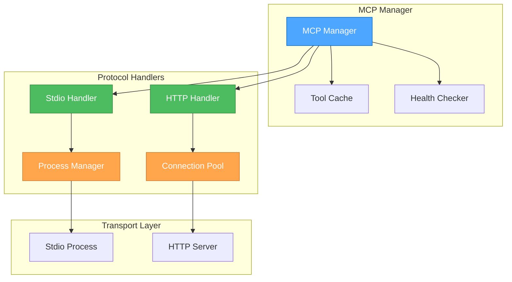

# 🎨🎨🎨 ENTERING CREATIVE PHASE: ARCHITECTURE DESIGN 🎨🎨🎨

## Focus: MCP Communication Protocol Abstraction
**Objective**: Design a flexible abstraction layer for MCP server communication supporting both stdio and HTTP transports
**Requirements**:
- Support for stdio-based communication (process pipes)
- Support for HTTP-based communication
- Tool discovery mechanism
- Graceful error handling and retry logic
- Connection pooling for HTTP transport
- Process lifecycle management for stdio transport

## PROBLEM STATEMENT
The MCP (Model Context Protocol) integration needs to:
1. Abstract away transport differences (stdio vs HTTP)
2. Manage server lifecycle (start, stop, health checks)
3. Discover and cache available tools
4. Handle request/response communication
5. Support multiple concurrent servers

## OPTIONS ANALYSIS

### Option 1: Interface-Based Transport Abstraction
**Description**: Define a common interface that both stdio and HTTP transports implement

**Architecture**:
```go
type Transport interface {
    Connect(config ServerConfig) error
    Send(request Request) error
    Receive() (Response, error)
    Close() error
}

type StdioTransport struct {
    cmd    *exec.Cmd
    stdin  io.WriteCloser
    stdout io.ReadCloser
    stderr io.ReadCloser
}

type HTTPTransport struct {
    client  *http.Client
    baseURL string
}
```

**Pros**:
- Clean interface separation
- Easy to add new transport types
- Straightforward implementation
- Good for simple request/response patterns

**Cons**:
- Limited flexibility for transport-specific features
- Difficult to handle streaming responses
- No built-in connection management
- Manual lifecycle management needed

**Complexity**: Low
**Implementation Time**: 2-3 days

### Option 2: Channel-Based Communication Layer
**Description**: Use Go channels for unified communication regardless of transport

**Architecture**:
```go
type MCPClient struct {
    transport   Transport
    requestChan chan Request
    responseChan chan Response
    errorChan   chan error
}

type Transport interface {
    Start() (chan<- Request, <-chan Response, <-chan error)
    Stop() error
}

type ChannelBridge struct {
    incoming <-chan Request
    outgoing chan<- Response
    errors   chan<- error
}
```

**Pros**:
- Unified communication model
- Natural Go concurrency patterns
- Built-in async support
- Easy to implement timeouts

**Cons**:
- More complex channel management
- Potential for channel deadlocks
- Memory overhead for channels
- Harder to debug

**Complexity**: Medium
**Implementation Time**: 3-4 days

### Option 3: Protocol Handler Pattern with Connection Pool
**Description**: Implement protocol handlers with built-in connection management and pooling

**Architecture**:
```go
type MCPManager struct {
    servers map[string]*ServerConnection
    pool    *ConnectionPool
    mu      sync.RWMutex
}

type ServerConnection struct {
    config    ServerConfig
    handler   ProtocolHandler
    tools     map[string]Tool
    health    *HealthChecker
}

type ProtocolHandler interface {
    Initialize(config ServerConfig) error
    Execute(method string, params interface{}) (interface{}, error)
    DiscoverTools() ([]Tool, error)
    HealthCheck() error
    Shutdown() error
}

type StdioHandler struct {
    process *ProcessManager
    codec   *jsonrpc.Codec
}

type HTTPHandler struct {
    client *http.Client
    pool   *ConnectionPool
    retry  *RetryPolicy
}
```

**Pros**:
- Comprehensive solution with all needed features
- Built-in connection pooling and health checks
- Protocol-specific optimizations possible
- Robust error handling and retry logic
- Production-ready design

**Cons**:
- Most complex to implement
- More code to maintain
- Higher initial development time

**Complexity**: High
**Implementation Time**: 5-6 days

## RECOMMENDED APPROACH

**Chosen Option**: Option 3 - Protocol Handler Pattern with Connection Pool

**Rationale**:
1. Production-ready design with all necessary features
2. Proper lifecycle management for both transport types
3. Built-in health checking and connection pooling
4. Extensible for future protocol additions
5. Clear separation of concerns

## IMPLEMENTATION PLAN

### Phase 1: Core Interfaces and Types
```go
// Core types
type ServerConfig struct {
    Name         string
    Transport    TransportType
    Command      string   // For stdio
    Args         []string // For stdio
    URL          string   // For HTTP
    Capabilities Capabilities
}

type TransportType int

const (
    TransportStdio TransportType = iota
    TransportHTTP
)

type Tool struct {
    Name        string
    Description string
    Parameters  json.RawMessage
}

// Main interface
type ProtocolHandler interface {
    Initialize(config ServerConfig) error
    Execute(method string, params interface{}) (interface{}, error)
    DiscoverTools() ([]Tool, error)
    HealthCheck() error
    Shutdown() error
}
```

### Phase 2: Stdio Protocol Handler
```go
type StdioHandler struct {
    config  ServerConfig
    process *ProcessManager
    codec   *jsonrpc.Codec
    mu      sync.Mutex
}

type ProcessManager struct {
    cmd     *exec.Cmd
    stdin   io.WriteCloser
    stdout  io.ReadCloser
    stderr  io.ReadCloser
    started bool
    mu      sync.Mutex
}

func (h *StdioHandler) Initialize(config ServerConfig) error {
    h.config = config
    h.process = &ProcessManager{}
    
    // Start the process
    cmd := exec.Command(config.Command, config.Args...)
    
    // Set up pipes
    stdin, _ := cmd.StdinPipe()
    stdout, _ := cmd.StdoutPipe()
    stderr, _ := cmd.StderrPipe()
    
    h.process.cmd = cmd
    h.process.stdin = stdin
    h.process.stdout = stdout
    h.process.stderr = stderr
    
    // Start process
    if err := cmd.Start(); err != nil {
        return fmt.Errorf("failed to start MCP server: %w", err)
    }
    
    // Initialize JSON-RPC codec
    h.codec = jsonrpc.NewCodec(stdin, stdout)
    
    return nil
}

func (h *StdioHandler) Execute(method string, params interface{}) (interface{}, error) {
    h.mu.Lock()
    defer h.mu.Unlock()
    
    var result interface{}
    err := h.codec.Call(method, params, &result)
    return result, err
}
```

### Phase 3: HTTP Protocol Handler
```go
type HTTPHandler struct {
    config ServerConfig
    client *http.Client
    pool   *ConnectionPool
    retry  *RetryPolicy
}

type ConnectionPool struct {
    maxConns    int
    connections chan *http.Client
    factory     func() *http.Client
}

type RetryPolicy struct {
    MaxRetries int
    BackoffMS  int
}

func (h *HTTPHandler) Initialize(config ServerConfig) error {
    h.config = config
    
    // Initialize connection pool
    h.pool = &ConnectionPool{
        maxConns: 10,
        connections: make(chan *http.Client, 10),
        factory: func() *http.Client {
            return &http.Client{
                Timeout: 30 * time.Second,
            }
        },
    }
    
    // Fill pool
    for i := 0; i < h.pool.maxConns; i++ {
        h.pool.connections <- h.pool.factory()
    }
    
    h.retry = &RetryPolicy{
        MaxRetries: 3,
        BackoffMS:  100,
    }
    
    return nil
}

func (h *HTTPHandler) Execute(method string, params interface{}) (interface{}, error) {
    // Get client from pool
    client := <-h.pool.connections
    defer func() { h.pool.connections <- client }()
    
    // Prepare request
    payload := map[string]interface{}{
        "jsonrpc": "2.0",
        "method":  method,
        "params":  params,
        "id":      uuid.New().String(),
    }
    
    body, _ := json.Marshal(payload)
    
    // Execute with retry
    var result interface{}
    err := h.executeWithRetry(client, body, &result)
    
    return result, err
}
```

### Phase 4: MCP Manager
```go
type MCPManager struct {
    servers  map[string]*ServerConnection
    mu       sync.RWMutex
    toolCache *ToolCache
}

type ServerConnection struct {
    config  ServerConfig
    handler ProtocolHandler
    tools   map[string]Tool
    health  *HealthChecker
}

type ToolCache struct {
    cache map[string][]Tool
    ttl   time.Duration
    mu    sync.RWMutex
}

func (m *MCPManager) StartServer(config ServerConfig) error {
    // Create appropriate handler
    var handler ProtocolHandler
    switch config.Transport {
    case TransportStdio:
        handler = &StdioHandler{}
    case TransportHTTP:
        handler = &HTTPHandler{}
    default:
        return fmt.Errorf("unsupported transport: %v", config.Transport)
    }
    
    // Initialize handler
    if err := handler.Initialize(config); err != nil {
        return err
    }
    
    // Discover tools
    tools, err := handler.DiscoverTools()
    if err != nil {
        return err
    }
    
    // Create server connection
    conn := &ServerConnection{
        config:  config,
        handler: handler,
        tools:   make(map[string]Tool),
        health:  NewHealthChecker(handler),
    }
    
    // Index tools
    for _, tool := range tools {
        conn.tools[tool.Name] = tool
    }
    
    // Store connection
    m.mu.Lock()
    m.servers[config.Name] = conn
    m.mu.Unlock()
    
    // Start health checker
    conn.health.Start()
    
    return nil
}
```

## ARCHITECTURE DIAGRAM



## VALIDATION

**Requirements Met**:
- ✓ Stdio-based communication support
- ✓ HTTP-based communication support
- ✓ Tool discovery mechanism
- ✓ Error handling and retry logic
- ✓ Connection pooling for HTTP
- ✓ Process lifecycle management

**Technical Feasibility**: High - Uses standard Go patterns and libraries
**Risk Assessment**: Low - Well-understood protocols and clear interfaces

🎨 CREATIVE CHECKPOINT: MCP Protocol Design Complete

The protocol handler pattern provides clean abstraction while allowing transport-specific optimizations. The design supports production-level features like health checking and connection pooling.

🎨🎨🎨 EXITING CREATIVE PHASE - DECISION MADE 🎨��🎨

**Summary**: Protocol Handler Pattern with Connection Pool selected
**Key Decisions**:
- Unified ProtocolHandler interface
- Transport-specific implementations
- Built-in health checking
- Connection pooling for HTTP
- Process management for stdio

**Next Steps**: Proceed with Plugin System design
