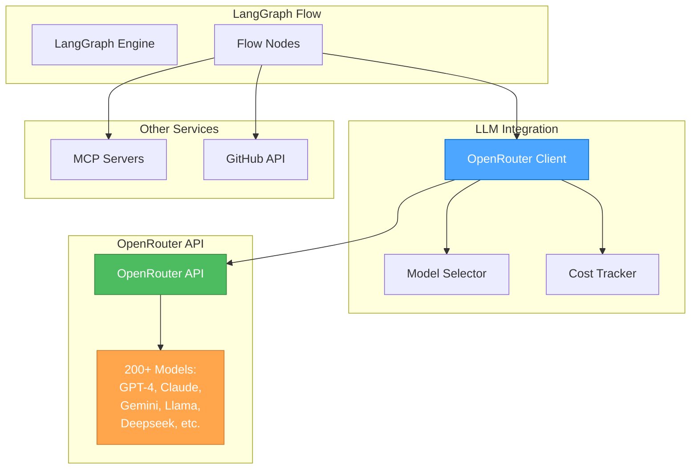

# 🎨🎨🎨 ENTERING CREATIVE PHASE: ARCHITECTURE REVISION 🎨🎨🎨

## Focus: OpenRouter Integration as LLM Facade
**Objective**: Revise our AI provider plugin system to use OpenRouter as the primary LLM integration
**Requirements**:
- Use go-openrouter for unified LLM access
- Support multiple models through single API
- Maintain flexibility for model selection
- Integrate with LangGraph nodes
- Preserve error handling capabilities

## PROBLEM STATEMENT
Instead of implementing separate integrations for each LLM provider, we will use OpenRouter which provides:
1. Access to 200+ models through one API
2. Automatic failover and load balancing
3. Cost tracking and rate limiting
4. Support for all major providers (OpenAI, Anthropic, Google, etc.)
5. Unified API regardless of underlying provider

## REVISED ARCHITECTURE

### Simplified LLM Integration

**Before (Multiple Providers)**:
```go
type AIProviderManager struct {
    providers map[string]AIProvider  // OpenAI, Anthropic, Google, etc.
}
```

**After (OpenRouter as Facade)**:
```go
type LLMService struct {
    client *openrouter.Client
    config LLMConfig
}

type LLMConfig struct {
    APIKey          string
    DefaultModel    string
    ModelOverrides  map[string]string  // step-specific models
    XTitle         string              // App identification
    HTTPReferer    string              // App URL
}
```

### Integration with LangGraph

```go
import (
    "github.com/tmc/langgraphgo/graph"
    "github.com/tmc/langchaingo/llms"
    openrouter "github.com/revrost/go-openrouter"
)

// OpenRouter adapter for LangGraph
type OpenRouterLLM struct {
    client *openrouter.Client
    model  string
}

// Implement langchaingo LLM interface
func (llm *OpenRouterLLM) GenerateContent(
    ctx context.Context,
    messages []llms.MessageContent,
    options ...llms.CallOption,
) (*llms.ContentResponse, error) {
    // Convert langchain messages to OpenRouter format
    orMessages := convertToOpenRouterMessages(messages)
    
    // Check for tools in options
    tools := extractTools(options)
    
    req := openrouter.ChatCompletionRequest{
        Model:    llm.model,
        Messages: orMessages,
    }
    
    // Add tools if present
    if len(tools) > 0 {
        req.Tools = convertToOpenRouterTools(tools)
    }
    
    // Add streaming if requested
    if isStreamingRequested(options) {
        return llm.handleStreaming(ctx, req)
    }
    
    // Standard completion
    resp, err := llm.client.CreateChatCompletion(ctx, req)
    if err != nil {
        return nil, err
    }
    
    // Convert response back to langchain format
    return convertToLangChainResponse(resp), nil
}
```

### Model Selection Strategy

```go
// Model selection with fallbacks
type ModelSelector struct {
    primary   string
    fallbacks []string
    costLimit float64
}

var ModelProfiles = map[string]ModelSelector{
    "fast": {
        primary:   openrouter.GPT35Turbo,
        fallbacks: []string{openrouter.ClaudeInstant, openrouter.Gemini15Flash},
    },
    "balanced": {
        primary:   openrouter.GPT4Turbo,
        fallbacks: []string{openrouter.Claude35Sonnet, openrouter.Gemini15Pro},
    },
    "powerful": {
        primary:   openrouter.GPT4O,
        fallbacks: []string{openrouter.Claude35Opus, openrouter.DeepseekV3},
    },
    "coding": {
        primary:   openrouter.DeepseekV3,
        fallbacks: []string{openrouter.GPT4O, openrouter.Claude35Sonnet},
    },
}

// Dynamic model selection based on task
func (s *LLMService) selectModel(step Step) string {
    // Check for explicit model in step config
    if step.Model != "" {
        return step.Model
    }
    
    // Check for model override
    if override, ok := s.config.ModelOverrides[step.ID]; ok {
        return override
    }
    
    // Select based on step characteristics
    if step.RequiresTools() {
        return ModelProfiles["powerful"].primary
    }
    
    if step.IsCodeAnalysis() {
        return ModelProfiles["coding"].primary
    }
    
    // Default model
    return s.config.DefaultModel
}
```

### Enhanced Node Creation

```go
func (e *FlowEngine) createOpenRouterNode(step Step) graph.NodeFunc {
    return func(ctx context.Context, state []llms.MessageContent) ([]llms.MessageContent, error) {
        // Select appropriate model
        model := e.llmService.selectModel(step)
        
        // Create OpenRouter LLM instance
        llm := &OpenRouterLLM{
            client: e.llmService.client,
            model:  model,
        }
        
        // Get MCP tools if specified
        var tools []llms.Tool
        if step.MCPServer != "" {
            mcpTools, err := e.mcpManager.GetTools(step.MCPServer, step.Tools)
            if err != nil {
                return nil, err
            }
            tools = convertMCPToLangChainTools(mcpTools)
        }
        
        // Build prompt with variables
        prompt := e.substituteVariables(step.Prompt.Template, state)
        
        // Add system message if configured
        messages := state
        if step.SystemPrompt != "" {
            messages = append([]llms.MessageContent{
                llms.TextParts(llms.ChatMessageTypeSystem, step.SystemPrompt),
            }, messages...)
        }
        
        // Add user prompt
        messages = append(messages, llms.TextParts(llms.ChatMessageTypeHuman, prompt))
        
        // Generate response with error handling
        resp, err := e.executeWithRetry(ctx, func() (*llms.ContentResponse, error) {
            return llm.GenerateContent(ctx, messages, 
                llms.WithTools(tools),
                llms.WithTemperature(step.Temperature),
                llms.WithMaxTokens(step.MaxTokens),
            )
        })
        
        if err != nil {
            return nil, e.handleLLMError(err, step, model)
        }
        
        // Append response to state
        return append(state, resp.Choices[0].Content), nil
    }
}
```

### Configuration Schema Update

```json
{
  "llm": {
    "provider": "openrouter",
    "apiKey": "${OPENROUTER_API_KEY}",
    "defaultModel": "gpt-4-turbo",
    "xTitle": "Flow Test Go",
    "httpReferer": "https://github.com/peterovchinnikov/flow-test-go",
    "modelOverrides": {
      "code-analysis": "deepseek/deepseek-chat",
      "creative-writing": "anthropic/claude-3.5-sonnet",
      "quick-response": "openai/gpt-3.5-turbo"
    }
  },
  "steps": {
    "analyze": {
      "type": "prompt",
      "model": "deepseek/deepseek-chat",  // Optional override
      "prompt": {
        "template": "Analyze this code: {{code}}"
      }
    }
  }
}
```

### Error Handling with OpenRouter

```go
func (e *FlowEngine) handleLLMError(err error, step Step, model string) error {
    // Check for specific OpenRouter errors
    if orErr, ok := err.(*openrouter.APIError); ok {
        switch orErr.Code {
        case "rate_limit_exceeded":
            // Try fallback model
            if fallback := e.getFallbackModel(model); fallback != "" {
                e.logger.Warn("Rate limited on %s, trying %s", model, fallback)
                return ErrRetryWithModel{Model: fallback}
            }
        case "model_not_available":
            // Model temporarily unavailable
            return ErrTransient{
                Err:   err,
                Retry: true,
                Wait:  30 * time.Second,
            }
        case "invalid_api_key":
            return ErrFatal{Err: err}
        }
    }
    
    // Generic error handling
    return e.errorHandler.Handle(err)
}
```

### Cost Tracking Integration

```go
type CostTracker struct {
    mu     sync.RWMutex
    costs  map[string]float64
    limits map[string]float64
}

func (c *CostTracker) RecordUsage(model string, usage openrouter.Usage) error {
    c.mu.Lock()
    defer c.mu.Unlock()
    
    cost := usage.TotalCost
    c.costs[model] += cost
    
    // Check limits
    if limit, ok := c.limits[model]; ok && c.costs[model] > limit {
        return fmt.Errorf("cost limit exceeded for model %s: %.4f > %.4f", 
            model, c.costs[model], limit)
    }
    
    return nil
}
```

## BENEFITS OF OPENROUTER INTEGRATION

1. **Simplified Architecture**: One integration instead of many
2. **Model Flexibility**: Access to 200+ models
3. **Automatic Failover**: Built-in redundancy
4. **Cost Management**: Unified billing and tracking
5. **Future Proof**: New models automatically available

## ARCHITECTURAL DIAGRAM



## IMPLEMENTATION PLAN

### Phase 1: Basic Integration
1. Add go-openrouter dependency
2. Create OpenRouter client wrapper
3. Implement langchaingo LLM interface
4. Test with simple prompts

### Phase 2: Advanced Features
1. Implement model selection logic
2. Add tool calling support
3. Enable streaming responses
4. Add structured output support

### Phase 3: Production Features
1. Cost tracking and limits
2. Rate limit handling
3. Model fallback logic
4. Usage analytics

## VALIDATION

**Requirements Met**:
- ✓ Unified LLM access through OpenRouter
- ✓ Support for multiple models
- ✓ Model selection flexibility
- ✓ LangGraph integration maintained
- ✓ Error handling preserved

🎨 CREATIVE CHECKPOINT: OpenRouter Integration Complete

Using OpenRouter as an LLM facade dramatically simplifies our architecture while providing access to a vast array of models with built-in failover and cost management.

🎨🎨🎨 EXITING CREATIVE PHASE - DECISION MADE 🎨🎨🎨

**Summary**: Use OpenRouter as primary LLM integration
**Key Decisions**:
- Single API for all LLM providers
- Dynamic model selection based on task
- Built-in failover and cost tracking
- Simplified error handling

**Next Steps**: Update dependencies and implementation plan
